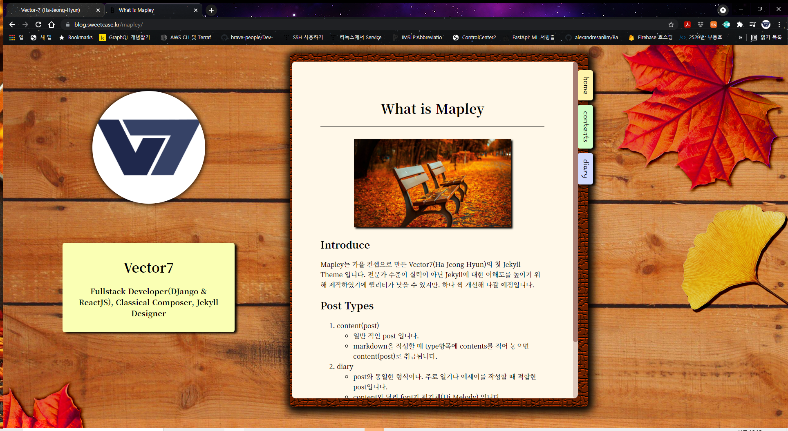
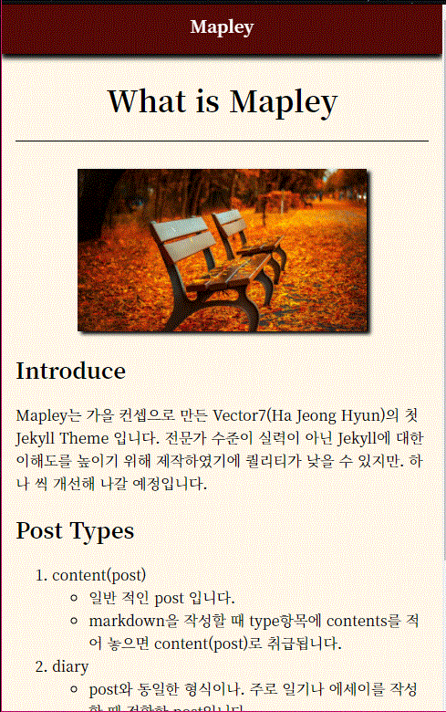

# mapley
 
**mapley** is **Jekyll Theme** that is an autumn & reading book style This is My First Jekyll theme for learning more about Jekyll. So It has some bug, but I'm going to do making and debugging this for better.

# Installation
## Forking From repository
You can install this the easiest by forking [mapley repository](https://github.com/Vector-7/mapley/fork)
## Direct Installation
1. Install Ruby
2. git clone from repository
```bash
git clone https://github.com/Vector-7/mapley.git
```
3. Install dependencies
```bash
bundle install
```
4. running
```bash
jekyll serve
```

# Setting (_config.yml)
```yml
title: [Blog Title]
email: [your email]
baseurl: [base url]
url: [deploy url]

# user info
username: [your nickname]
introduce: [summary about yourself]
```

# How to write posts
## In contents(Post)
make new markdown file to ```_posts``` and write config like this
**you must write type to "contents"**
```yml
---
layout: post
title: [your post title]
date: [select write date]
type: contents
category: [select category]
tags: [tag array] (ex: ["tag1", "tag2" ...])
---
```

## In Diary
make new markdown file to ```_posts``` and write config like this
```yml
---
layout: post
title: [your post title]
date: [select write date]
type: diary
tags: [tag array] (ex: ["tag1", "tag2" ...])
---
```


# Writing Posts